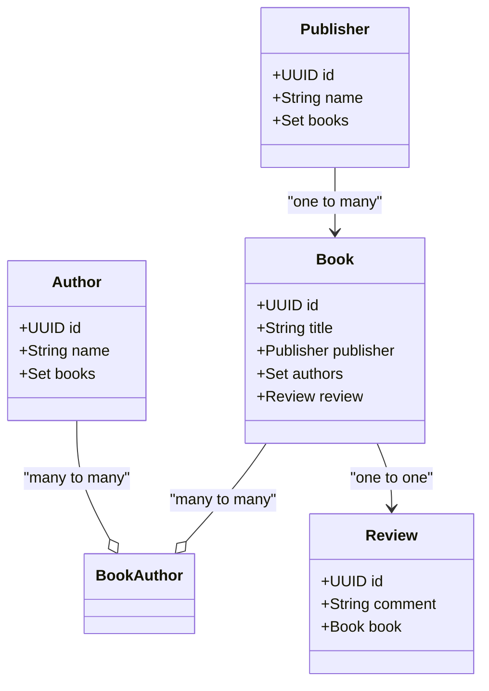

# JPA

## Diagrama de Classes

```mermaid
classDiagram
    class Book {
        +UUID id
        +String title
        +Publisher publisher
        +Set<Author> authors
        +Review review
    }
    
    class Author {
        +UUID id
        +String name
        +Set<Book> books
    }
    
    class Publisher {
        +UUID id
        +String name
        +Set<Book> books
    }
    
    class Review {
        +UUID id
        +String comment
        +Book book
    }
    
        
    Author --o BookAuthor : "many to many"
    Book --o BookAuthor : "many to many"
    Publisher --> Book : "one to many"
    Book --> Review : "one to one"
```
